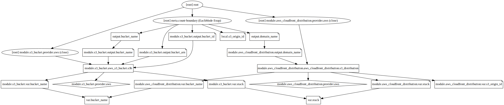

# AWS S3 - CloudFront Demo

This project shows a way to configure a Cloudfront site connected to an S3 encrypted bucket.

## Generation

All the requirements are on the [versions.tf](versions.tf) file, to generate the stack please run:

```bash
terraform init && terraform plan && terraform apply
```

Make sure that that your own states [backend](backend.tf) is set up with your bucket name.

## Graph



## Contributing
Pull requests are welcome. For major changes, please open an issue first to discuss what you would like to change.
